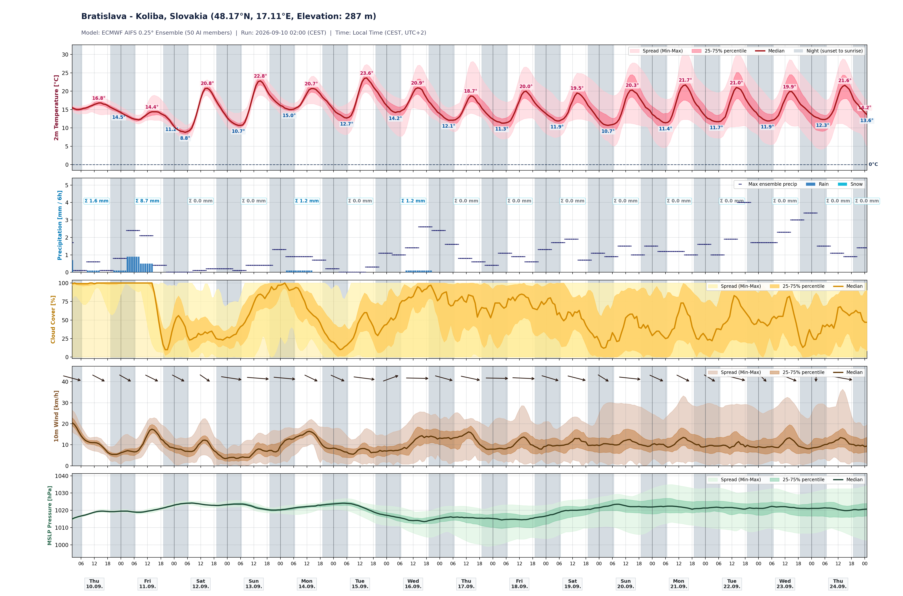

# ECMWF AIFS Meteogram Generator (SHMÚ EPSGRAM Style)

An advanced meteorological visualization system inspired by [SHMÚ's ECMWF EPSGRAM](https://www.shmu.sk/sk/?page=1&id=meteo_epsgramy&nwp_mesto=34031#ecmwf), powered by open forecast data from ECMWF's **AIFS** (*Artificial Intelligence Forecasting System* 0.25° Ensemble — 50 AI members) and DWD's regional high-resolution ensembles (**ICON-EU** and **ICON-D2**).



---

## 🏛️ Project Architecture

The repository is structured into three clean, dedicated components:

```
meteogram/
├── server/           # ⚡ Python backend server, CLI generator & rendering engine
│   ├── server.py     # HTTP server & API (/api/image, /api/check_location)
│   ├── renderer.py   # High-resolution matplotlib EPSGRAM rendering engine
│   ├── aifs_client.py# Open-Meteo ensemble API client & geocoder
│   ├── meteogram.py  # Standalone CLI generation tool
│   └── requirements.txt
├── web/              # 🌐 Web dashboard frontend (HTML5, CSS3, Vanilla JS)
│   └── index.html    # Interactive client with search, presets & model alert banner
└── MeteogramApp/     # 📱 Native Apple Multiplatform App (iOS, iPadOS & macOS)
    ├── MeteogramApp.xcodeproj
    ├── Sources/      # SwiftUI views, models, services & viewmodels
    └── README.md     # Detailed iOS & macOS setup guide
```

---

## 🚀 Quick Start

### 1. Install Dependencies

Clone the repository and install the Python requirements:

```bash
git clone https://github.com/igorcerovsky/AIFS-meteogram.git
cd AIFS-meteogram
pip install -r server/requirements.txt
```

### 2. Launch the Backend Server

Start the lightweight Python server (serves both the Web UI and the Apple App API):

```bash
python3 server/server.py 8080
```

---

## 🌐 1. Web Dashboard (`web/`)

Open [http://localhost:8080](http://localhost:8080) in your browser once the server is running.

### Key Features
- **Search & Quick Presets**: Type any city name or GPS coordinates (`lat, lon`), or tap preset chips (*Bratislava-Koliba, Jasná, Liptovský Mikuláš, Plavecké Podhradie, Košice, Poprad/Tatry, Vienna, Prague*).
- **Model Selection**:
  - **ECMWF AIFS Global Ensemble**: 15 days, 10 days, 7 days (50 AI members).
  - **DWD ICON-EU Regional Ensemble**: 5 days (7.0 km resolution, 40 members).
  - **DWD ICON-D2 High-Resolution Ensemble**: 2 days / 48h (2.2 km resolution, 20 members).
- **Intelligent Fallback Alert**: Automatic detection when a location is outside the Central Europe ICON-D2 domain, seamlessly transitioning to ICON-EU with an informative notification banner.
- **Language & Time Zone**: Full support for English (`en`) and Slovak (`sk`), and Local Time or UTC.
- **Instant Export**: Download high-resolution PNGs or open full-size graphs in a new tab.

---

## 📱 2. Native Apple App for iOS & macOS (`MeteogramApp/`)

A native SwiftUI multiplatform application running seamlessly on **macOS 14.0+** (Apple Silicon & Intel) and **iOS / iPadOS 17.0+** (iPhone & iPad).

### Key Features
- **Swipe Between Models**: Swipe left or right directly on the chart to cycle models in the natural order:
  $$\mathbf{15\text{ days}} \longleftrightarrow \mathbf{2\text{ days}} \longleftrightarrow \mathbf{5\text{ days}} \longleftrightarrow \mathbf{10\text{ days}} \longleftrightarrow \mathbf{7\text{ days}}$$
  *(Automatically bypasses 2-day ICON-D2 when a location is outside coverage).*
- **Sleek Model Pill Bar**: Compact `[ 15d | 2d | 5d | 10d | 7d ]` selector with real-time status and active indicator.
- **Interactive Gesture Zoom**: Fluid pinch-to-zoom (up to 400%), smooth panning, double-tap zoom reset, and floating zoom controls.
- **Off-Screen Pan Boundary Constraints**: Clamped viewport mathematics ensure the graph cannot be accidentally dragged outside the visible screen.
- **Layered UI**: Location search bar and model pills are pinned cleanly on top (`zIndex`), never overlapped by the chart.
- **One-Tap GPS**: Automatically fetches your device's current location via `CoreLocation`.
- **Bonjour Server Discovery**: Connects via `localhost:8080` on Mac, or one-tap `Igors-MacBook-Air.local:8080` (or Wi-Fi IP) on iPhone/iPad with live latency diagnostics.
- **Native Integrations**: System Share Sheet, Copy Image to Clipboard (`⌘C`), and Refresh (`⌘R`).

### How to Run
```bash
open MeteogramApp/MeteogramApp.xcodeproj
```
Select **My Mac** or your **iPhone Simulator** / physical device in Xcode and press **Run (`⌘R`)**. For more details, see [MeteogramApp/README.md](MeteogramApp/README.md).

---

## ⚡ 3. Python Server & CLI (`server/`)

### CLI Usage (`server/meteogram.py`)

Generate a publication-quality meteogram directly from the command line:

```bash
# Default location (Bratislava-Koliba, 15 days, English)
python3 server/meteogram.py

# Specify location and horizon
python3 server/meteogram.py --location "Liptovsky Mikulas" --days 10 --output liptov.png

# High-resolution regional 2-day ICON-D2 forecast in Slovak
python3 server/meteogram.py --location "Bratislava-Koliba" --model icon_d2 --days 2 --lang sk

# Exact GPS coordinates (lat, lon)
python3 server/meteogram.py --location "48.148,17.107" --output custom_coords.png
```

#### CLI Options

| Argument | Default | Description |
| --- | --- | --- |
| `-l`, `--location` | `Bratislava-Koliba` | City name or `lat,lon` coordinates |
| `-m`, `--model` | `aifs` | Model: `aifs` (ECMWF AI), `icon_d2` (2.2 km, 48h), `icon_eu` (7.0 km, 5-day) |
| `-d`, `--days` | `15` | Forecast duration in days |
| `-o`, `--output` | `.img/<loc>_meteogram.png` | Output file path (`.png`, `.svg`, `.pdf`) |
| `--lang` | `en` | Label language: `en` (English) or `sk` (Slovak) |
| `--tz` | `local` | Timezone: `local` (summer/winter auto-detected) or `utc` |
| `--dpi` | `200` | Resolution for rendered raster image |

### HTTP API (`server/server.py`)

- **`GET /api/image`**: Generates and serves dynamic PNG meteograms.
  - Parameters: `location`, `days`, `model`, `lang`, `tz`.
  - Response Headers: `X-Actual-Model`, `X-Model-Fallback`, `X-Fallback-From`.
  - Caching: Automated caching in `.cache/` with 1-hour expiry and auto-invalidation on renderer updates.
- **`GET /api/check_location`**: Geocodes locations, determines altitude, and checks DWD ICON-D2 domain boundaries.

---

## 📊 Weather Parameters Visualized

1. **2m Air Temperature**: Solid red median line, 25–75% interquartile range (IQR salmon band), full 50-member min-max spread (light pink band), 0°C freezing line, and labeled daily min/max values.
2. **Precipitation & Snowfall**: 6-hour interval bars for rain and snow, ensemble maximum accumulation ticks, and daily sum totals (`Σ X.X mm`).
3. **Total Cloud Cover**: Cloud coverage percentage (0–100%) with median curve, IQR band, and spread fill.
4. **10m Wind Speed & Direction**: Wind speed curve combined with meteorological wind direction arrows pointing where the wind is blowing.
5. **Mean Sea Level Pressure (MSLP)**: Atmospheric pressure curve (hPa) and ensemble spread.
6. **Astronomical Day / Night Shading**: Accurate grey background shading for nighttime periods calculated between astronomical sunrise and sunset for each day and timezone.

---

## 📄 License & Attribution

- **Data Sources**:
  - ECMWF AIFS Open Data &copy; European Centre for Medium-Range Weather Forecasts ([CC-BY 4.0](https://creativecommons.org/licenses/by/4.0/))
  - DWD Open Data &copy; Deutscher Wetterdienst
  - Geocoding & API distribution via [Open-Meteo](https://open-meteo.com)
- **Visual Style**: Inspired by Slovak Hydrometeorological Institute ([SHMÚ](https://www.shmu.sk)) EPSGRAM layouts.
- **License**: GNU General Public License v3 (see [LICENSE](LICENSE)).
