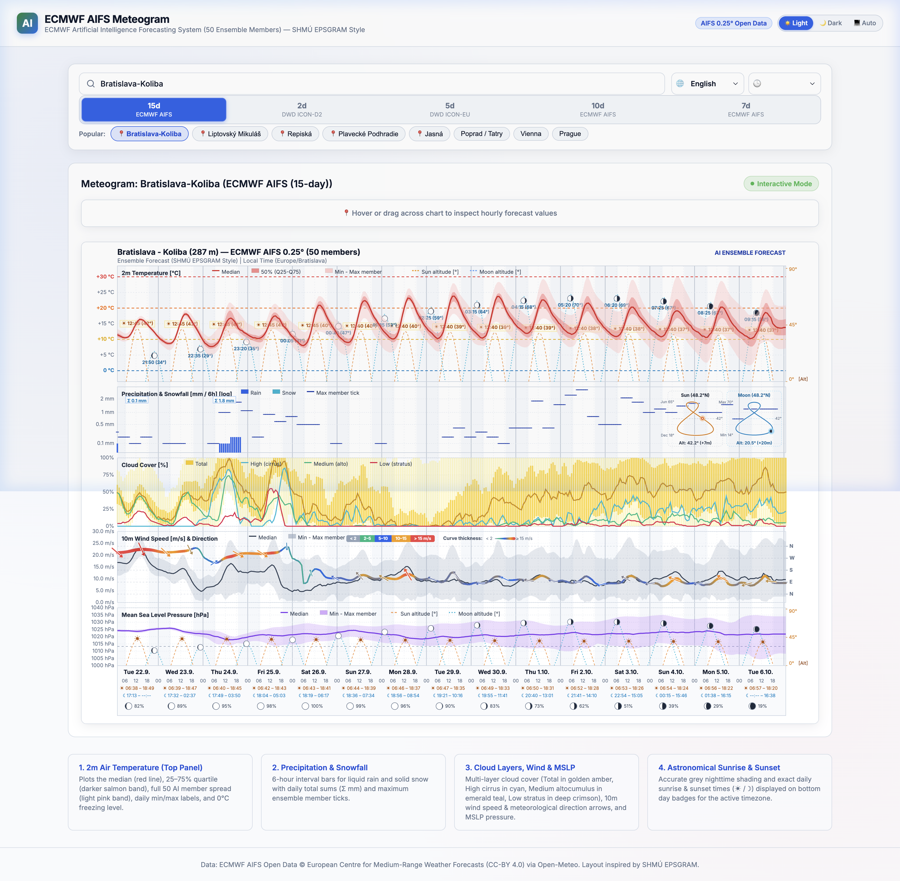

# ECMWF AIFS Meteogram Generator (SHMÚ EPSGRAM Style)

An advanced meteorological visualization system inspired by [SHMÚ's ECMWF EPSGRAM](https://www.shmu.sk/sk/?page=1&id=meteo_epsgramy&nwp_mesto=34031#ecmwf), powered by open forecast data from ECMWF's **AIFS** (*Artificial Intelligence Forecasting System* 0.25° Ensemble — 50 AI members) and DWD's regional high-resolution ensembles (**ICON-EU** and **ICON-D2**).

🌐 **Live Meteogram Web Page**: [https://igorcerovsky.github.io/AIFS-meteogram/](https://igorcerovsky.github.io/AIFS-meteogram/)


---

## 🏛️ Project Architecture

The repository is structured into three clean, dedicated components:

```
meteogram/
├── server/           # ⚡ Python backend server, CLI generator & rendering engine
│   ├── server.py     # HTTP server & API (/api/forecast, /api/image, /api/check_location)
│   ├── renderer.py   # High-resolution matplotlib EPSGRAM rendering engine
│   ├── aifs_client.py# Open-Meteo ensemble API client & geocoder
│   ├── meteogram.py  # Standalone CLI generation tool
│   └── requirements.txt
├── web/              # 🌐 Web dashboard frontend (HTML5, CSS3, Vanilla JS)
│   ├── index.html    # Interactive client with search, presets, model alerts & theme adaptation
│   └── meteogram-chart.js # Dynamic Retina canvas engine with HUD crosshair & direct API fallback
└── MeteogramApp/     # 📱 Native Apple Multiplatform App (iOS, iPadOS & macOS)
    ├── MeteogramApp.xcodeproj
    ├── Sources/      # SwiftUI views, models, services & viewmodels
    └── README.md     # Detailed iOS & macOS setup guide
```

---

## 🚀 Quick Start

### 1. Install Dependencies

Clone the repository and install the Python requirements:

```bash
git clone https://github.com/igorcerovsky/AIFS-meteogram.git
cd AIFS-meteogram
pip install -r server/requirements.txt
```

### 2. Launch the Backend Server

Start the lightweight Python server (serves the Web UI, JSON forecast API, and Apple App API):

```bash
python3 server/server.py 8080
```

---

## 🌐 1. Interactive Web Dashboard (`web/`)
- 🚀 **Live GitHub Pages Web App**: [https://igorcerovsky.github.io/AIFS-meteogram/](https://igorcerovsky.github.io/AIFS-meteogram/)
- 💻 **Local Development**: Open [http://localhost:8080](http://localhost:8080) in your browser once the server is running.



### Key Features
- **Dynamic HTML5 Canvas Engine (`web/meteogram-chart.js`)**:
  - Automatically scales with `devicePixelRatio` for razor-sharp rendering on Retina and HiDPI displays.
  - Interactive crosshair tracking across all 5 synchronized panels with real-time value indicators.
  - Floating glassmorphism HUD tooltip showing exact temperature, precipitation, cloud breakdown, wind speed/direction, pressure, and celestial altitudes at the hovered timestamp.
  - **Location-Aware Celestial Analemmas**: Side-by-side Solar & Lunar figure-8 analemma cards embedded directly in the precipitation pane with transparent backgrounds.
  - **Logarithmic Precipitation Scaling**: Pseudo-logarithmic scaling that expands low-intensity precipitation ($0.1 - 2.0\text{ mm}$) for clear visibility of light rain, drizzle, and snow.
  - **Continuous Loop Wind Direction & Dual Velocity Encoding**: Continuous `N-W-S-E-N` looping trajectory with speed-proportional stroke thickness and multi-threshold color coding.
- **Search & Quick Presets**: Type any city name or GPS coordinates (`lat, lon`), or tap preset chips (*Bratislava-Koliba, Jasná, Liptovský Mikuláš, Plavecké Podhradie, Košice, Poprad/Tatry, Vienna, Prague*).
- **Model Selection**:
  - **ECMWF AIFS Global Ensemble**: 15 days, 10 days, 7 days (50 AI members).
  - **DWD ICON-EU Regional Ensemble**: 5 days (7.0 km resolution, 40 members).
  - **DWD ICON-D2 High-Resolution Ensemble**: 2 days / 48h (2.2 km resolution, 20 members).
- **Automatic Browser Theme Matching**: Seamlessly adapts backgrounds, borders, chips, and typography to system dark or light mode preferences (`prefers-color-scheme`).
- **Zero-Backend GitHub Pages Fallback**: Includes a client-side direct fetch engine that queries Open-Meteo's CORS-enabled API directly, allowing the interactive meteogram to run statically on GitHub Pages for any global coordinate without requiring a backend server.
- **Language & Timezone Switching**: Instant client-side re-rendering when toggling between English (`en`) and Slovak (`sk`), or Local Time and UTC.
- **Intelligent Fallback Alert**: Automatic notification when coordinates lie outside the ICON-D2 Central Europe boundary, seamlessly switching to ICON-EU.

---

## 📱 2. Native Apple App for iOS & macOS (`MeteogramApp/`)

A native SwiftUI multiplatform application running seamlessly on **macOS 14.0+** (Apple Silicon & Intel) and **iOS / iPadOS 17.0+** (iPhone & iPad).

### Key Features
- **Swipe Between Models**: Swipe left or right directly on the chart to cycle models in the natural order:
  $$\mathbf{15\text{ days}} \longleftrightarrow \mathbf{2\text{ days}} \longleftrightarrow \mathbf{5\text{ days}} \longleftrightarrow \mathbf{10\text{ days}} \longleftrightarrow \mathbf{7\text{ days}}$$
  *(Automatically bypasses 2-day ICON-D2 when a location is outside coverage).*
- **Native Swift Charts**: Feature parity with web canvas including pseudo-logarithmic precipitation scaling, transparent side-by-side Solar & Lunar Analemma cards, and continuous wind direction curves.
- **Sleek Model Pill Bar**: Compact `[ 15d | 2d | 5d | 10d | 7d ]` selector with real-time status and active indicator.
- **Interactive Gesture Zoom**: Fluid pinch-to-zoom (up to 400%), smooth panning, double-tap zoom reset, and floating zoom controls.
- **Off-Screen Pan Boundary Constraints**: Clamped viewport mathematics ensure the graph cannot be accidentally dragged outside the visible screen.
- **Layered UI**: Location search bar and model pills are pinned cleanly on top (`zIndex`), never overlapped by the chart.
- **One-Tap GPS**: Automatically fetches your device's current location via `CoreLocation`.
- **Bonjour Server Discovery**: Connects via `localhost:8080` on Mac, or one-tap `Igors-MacBook-Air.local:8080` (or Wi-Fi IP) on iPhone/iPad with live latency diagnostics.
- **Native Integrations**: System Share Sheet, Copy Image to Clipboard (`⌘C`), and Refresh (`⌘R`).

### How to Run
```bash
open MeteogramApp/MeteogramApp.xcodeproj
```
Select **My Mac** or your **iPhone Simulator** / physical device in Xcode and press **Run (`⌘R`)**. For more details, see [MeteogramApp/README.md](MeteogramApp/README.md).

---

## ⚡ 3. Python Server & CLI (`server/`)

### CLI Usage (`server/meteogram.py`)

Generate a publication-quality meteogram directly from the command line:

```bash
# Default location (Bratislava-Koliba, 15 days, English)
python3 server/meteogram.py

# High-resolution regional 5-day ICON-EU forecast
python3 server/meteogram.py --location "Bratislava-Koliba" --model icon_eu --days 5 --lang en

# High-resolution regional 2-day ICON-D2 forecast in Slovak
python3 server/meteogram.py --location "Bratislava-Koliba" --model icon_d2 --days 2 --lang sk

# Specify custom location, duration, and output file
python3 server/meteogram.py --location "Liptovsky Mikulas" --days 10 --output liptov.png

# Exact GPS coordinates (lat, lon)
python3 server/meteogram.py --location "48.148,17.107" --output custom_coords.png
```

#### CLI Options

| Argument | Default | Description |
| --- | --- | --- |
| `-l`, `--location` | `Bratislava-Koliba` | City name or `lat,lon` coordinates |
| `-m`, `--model` | `aifs` | Model: `aifs` (ECMWF AI, 7–15d), `icon_eu` (7.0 km, 5d), `icon_d2` (2.2 km, 48h) |
| `-d`, `--days` | `15` | Forecast duration in days |
| `-o`, `--output` | `.img/<loc>_meteogram.png` | Output file path (`.png`, `.svg`, `.pdf`) |
| `--lang` | `en` | Label language: `en` (English) or `sk` (Slovak) |
| `--tz` | `local` | Timezone: `local` (summer/winter auto-detected) or `utc` |
| `--dpi` | `200` | Resolution for rendered raster image |

### HTTP API (`server/server.py`)

- **`GET /api/forecast`**: Serves structured forecast JSON data, ensemble statistics (median, IQR, min/max spreads), and astronomical ephemeris for the dynamic web canvas.
  - Parameters: `location`, `days`, `model`, `lang`, `tz`.
  - Caching: Automatic server-side disk cache with 1-hour validity ($< 1\text{ ms}$ response).
- **`GET /api/image`**: Generates and serves high-resolution raster PNG meteograms for native apps or static embedding.
  - Parameters: `location`, `days`, `model`, `lang`, `tz`.
  - Response Headers: `X-Actual-Model`, `X-Model-Fallback`, `X-Fallback-From`.
- **`GET /api/check_location`**: Geocodes locations, resolves elevation, and validates DWD ICON-D2 domain boundaries.

---

## 📊 Weather Parameters Visualized

1. **2m Air Temperature (°C)**:
   - Median trajectory curve, interquartile 25–75% band, and full ensemble min-max spread.
   - **Colored Threshold Grid Lines**: Distinctive reference levels at $-10^\circ\text{C}$ (light blue), $0^\circ\text{C}$ (freezing level blue), $+10^\circ\text{C}$ (yellow), $+20^\circ\text{C}$ (orange), and $+30^\circ\text{C}$ (red).
   - **Sun & Moon Celestial Trajectories**: Continuous elevation arcs rising from and landing strictly at the bottom horizon line, annotated with culmination peak badges (`☀ HH:MM (XX°)`, `☾ HH:MM (XX°)`).
   - **Right Y-Axis Celestial Degree Scale**: Dedicated $0^\circ$, $45^\circ$, $90^\circ$ `[Alt]` reference ticks.
2. **Precipitation & Snowfall (mm)**:
   - **Logarithmic Scaling `[log]`**: Formulated with a transition factor ($v_0 = 0.2\text{ mm}$) to expand light precipitation events ($0.1 - 2.0\text{ mm}$) that would otherwise be imperceptible on linear scales.
   - **Logarithmic Reference Grid**: Non-linear grid lines at $0.1, 0.2, 0.5, 1, 2, 5, 10, \dots\text{ mm}$.
   - Liquid rain bars, snowfall bars, max-member tick caps, and daily cumulative sum badges (`Σ X.X mm`).
   - **Side-by-Side Solar & Lunar Analemmas**: Embedded in the top-right with transparent backgrounds:
     - **Solar Analemma**: Annual figure-8 tracking solar declination against the Equation of Time ($+16\text{m}$ to $-14\text{m}$) for the active location.
     - **Lunar Analemma**: Closed monthly figure-8 loop reflecting orbital inclination to the celestial equator and Equation of Time harmonics, with an illuminated phase-accurate Moon marker locked strictly on the curve.
3. **Multi-layer Cloud Cover (%)**:
   - **Total Cloud Cover**: Yellow vertical percentile bars with light yellow min-max spread, warm yellow Q25–Q75 interquartile bars, and golden median ticks and trajectory line.
   - **Cloud Layers (Single Curves)**: High Cirrus (cyan `#06b6d4`), Medium Alto (emerald `#10b981`), and Low Stratus (crimson `#e11d48`) rendered as clean single median lines.
4. **10m Wind Speed & Direction**:
   - **Continuous 5-Point Direction Loop**: Mapped to `N` (top), `W`, `S`, `E`, and `N` (bottom) across a unified, continuous grid to prevent discontinuous edge jumps for north-westerly and northerly winds.
   - **Dual Speed Encoding**:
     - **Curve Thickness**: Line weight scales proportionally with wind speed ($< 2\text{ m/s}$ hairline to $\ge 15\text{ m/s}$ heavy).
     - **Speed Color Categories**: Segmented into grey ($< 2\text{ m/s}$), teal ($2-5\text{ m/s}$), emerald ($5-10\text{ m/s}$), amber ($10-15\text{ m/s}$), and crimson ($> 15\text{ m/s}$).
   - **Wind Direction Arrows**: Rotational meteorological arrows pointing in the direction of wind flow.
5. **Mean Sea Level Pressure (MSLP, hPa)**:
   - Atmospheric pressure curve and ensemble spread, $1013.25\text{ hPa}$ standard atmosphere reference line, and synchronized Sun/Moon celestial elevation trajectories with the right-axis `[Alt]` scale.
6. **Daytime & Night Shading Across All Panels**:
   - Daytime shading contrasted with twilight/night bands calculated from astronomical solar altitude.
7. **Astronomical Ephemeris Timeline**:
   - Daily cards displaying weekday, calendar date, sunrise and sunset (`☀ HH:MM – HH:MM`), moonrise and moonset (`☾ HH:MM – HH:MM`), and illuminated vector Moon phase discs with illumination percentages.

---

## 📄 License & Attribution

- **Data Sources**:
  - ECMWF AIFS Open Data &copy; European Centre for Medium-Range Weather Forecasts ([CC-BY 4.0](https://creativecommons.org/licenses/by/4.0/))
  - DWD Open Data &copy; Deutscher Wetterdienst
  - Geocoding & API distribution via [Open-Meteo](https://open-meteo.com)
- **Visual Style**: Inspired by Slovak Hydrometeorological Institute ([SHMÚ](https://www.shmu.sk)) EPSGRAM layouts.
- **License**: GNU General Public License v3 (see [LICENSE](LICENSE)).
